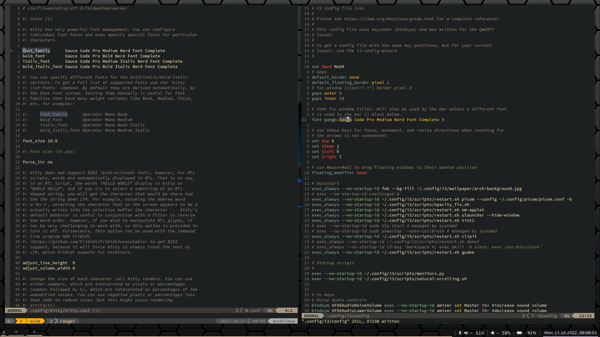
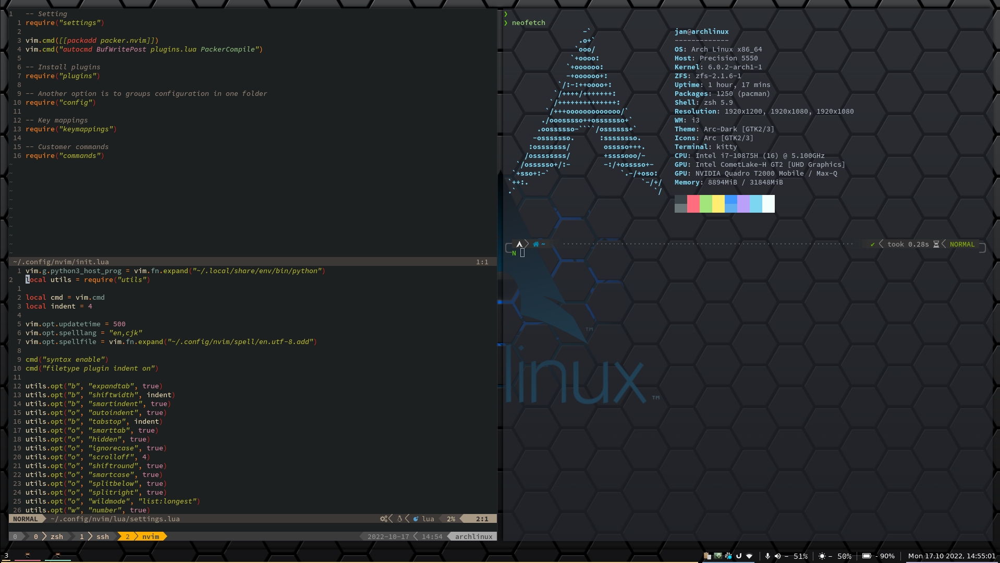
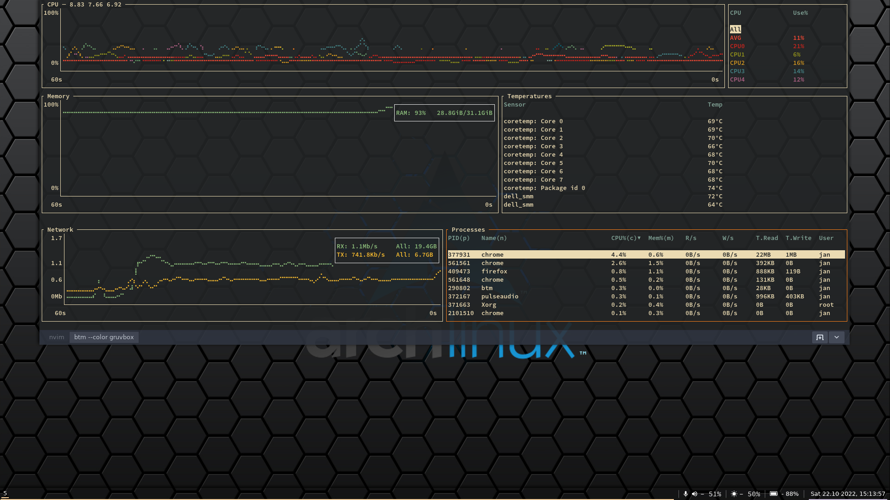

## Welcome to my dotfiles!

<i>This dotfiles contains my personal configurations, wallpapers and scripts.</i>

### Setup:

- **OS:** Arch linux
- **Window Manager:** i3
- **Terminal:** Kitty
- **Terminal Multiplexer:** Tmux
- **Shell:** ZSH
- **Editor:** Nvim
- **Application Launcher:** Ulauncher
- **Bar:** Tint2
- **Browser:** Firefox
- **File Manager:** Ranger
- **Text Fonts and Icon Fonts:** mostly [Source Code Pro](https://www.nerdfonts.com/)

### Screenshots:

